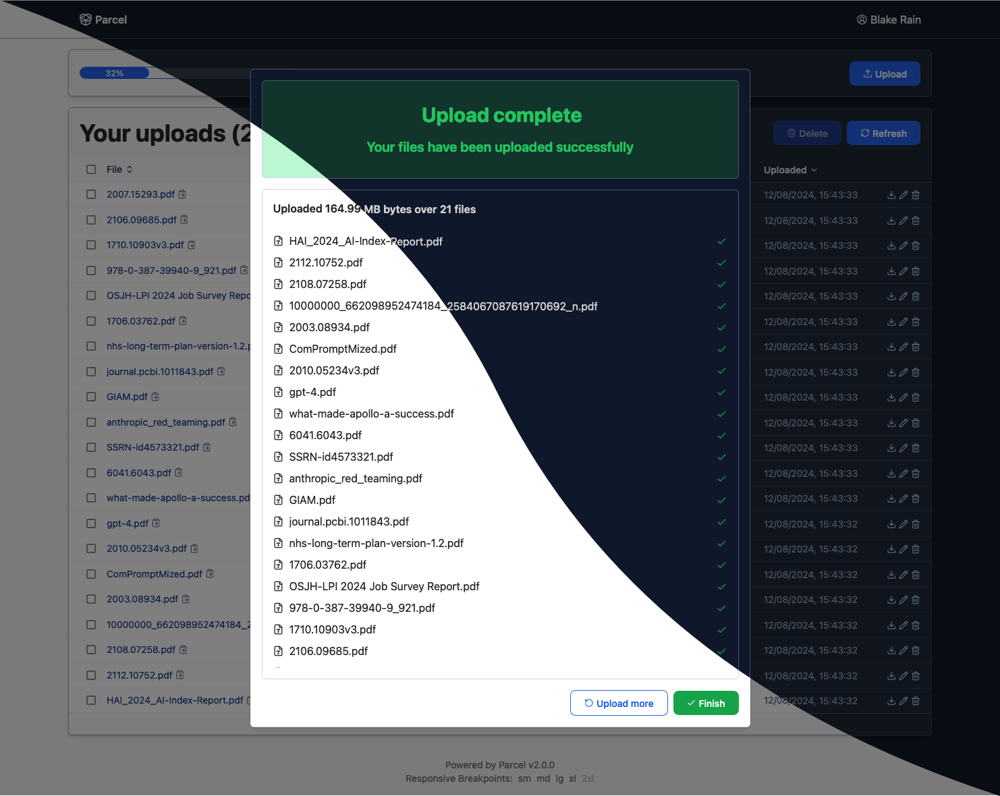

# parcel – A simple file upload tool

<picture>
 <source media="(prefers-color-scheme: dark)" srcset="media/masked-screenshot.png">
 <source media="(prefers-color-scheme: light)" srcset="media/masked-screenshot.png">
 
</picture>

---

Parcel is a simple light-weight file upload application with a nice UI and a small set of features.

- Support multiple users and administrators
- Uploaded files can be made public to allow download from anywhere
- Number of downloads can be limited, and downloads can have an expiry date
- Files are stored in separate cache directory
- Data is stored in an [SQLite] database
- Written in [Rust] using the [Poem] web framework
- Styled using [Tailwind CSS]
- Using [Preact] and Web Components

## Running Parcel

The easiest way to run Parcel is with Docker, using the
[blakerain/parcel](https://hub.docker.com/r/blakerain/parcel) image on Dockerhub:

```
docker run blakerain/parcel
```

Parcel can be controlled through arguments or environment variables. The environment variables are a
useful way to control Parcel when creating a Docker container.

| Environment Name   | Default              | Description                               |
|--------------------|----------------------|-------------------------------------------|
| `DB`               | `sqlite://parcel.db` | SQLite connection string                  |
| `CACHE_DIR`        | `./cache`            | Directory for file cache                  |
| `COOKIE_SECRET`    |                      | Secret used for session cookie encryption |
| `ANALYTICS_DOMAIN` |                      | Domain to use for analytics script        |
| `PLAUSIBLE_SCRIPT` |                      | URL for [Plausible Analytics] script      |

For example, if you had created a volume `parcel_data` and mounted it under `/data` you could tell
Parcel to store the DB and file cache in that location by setting the `DB` environment variable to
`sqlite:///data/parcel.db` and `CACHE_DIR` to `/data/cache`.

If you do not set the `COOKIE_SECRET`, you will end up being logged out every time that the
container starts. To mitigate this, pass a value for `COOKIE_SECRET` when starting the container.

```
docker run -d \
  --name my-parcel \
  -e DB=sqlite:///data/parcel.db \
  -e CACHE_DIR=/data/cache \
  -e COOKIE_SECRET=$(openssl rand -base64 32 | tr -d '\n' ; echo) \
  -e ANALYTICS_DOMAIN=parcel.example.com \
  -e PLAUSIBLE_SCRIPT=https://pa.example.com/js/script.js \
  -v parcel_data:/data
```

## Development

When running as a development server, [cargo watch] is mighty helpful. You may also wish to set up a
cookie key (in the `COOKIE_SECRET` environment variable) to avoid being signed out after a restart:

```bash
# Initial setup of a cookie key
COOKIE_SECRET=$(openssl rand -base64 32 | tr -d '\n' ; echo)
export COOKIE_SECRET

# Run the server, but recompile/restart on any changes
cargo watch -L debug -x run
```

> Please Note: The icon used for this application is the [package-open] icon from the [Lucide] icon
> pack.

[package-open]: https://lucide.dev/icons/package-open
[lucide]: https://lucide.dev/
[cargo watch]: https://github.com/watchexec/cargo-watch
[plausible analytics]: https://plausible.io/
[rust]: https://rust-lang.org/
[Poem]: https://github.com/poem-web/poem
[Sqlite]: https://sqlite.org/
[Tailwind CSS]: https://tailwindcss.com/
[Preact]: https://preactjs.com/
